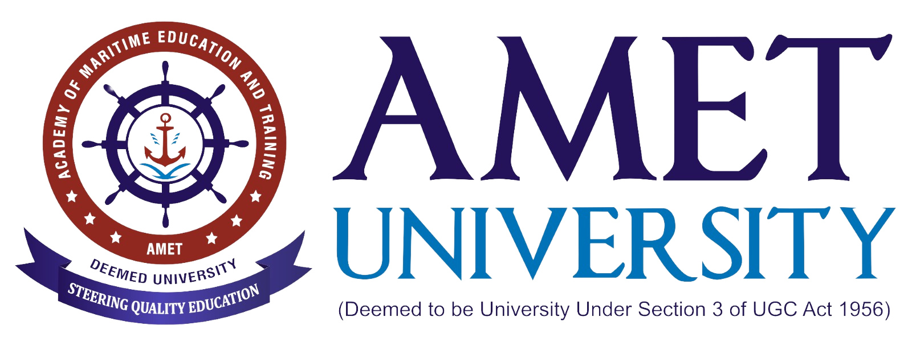
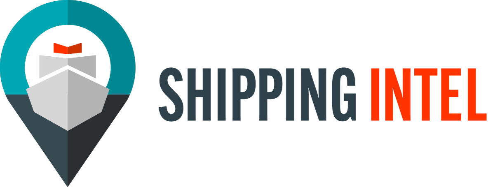

# Gender Identification in Maritime using TensorFlow and PyTorch

This project implements gender identification models tailored to the maritime industry using TensorFlow and PyTorch. The goal is to analyze maritime-related imagery to address gender disparity in the maritime sector.

---

## Collaborators:

<p align="center">
  
&nbsp;  &nbsp;&nbsp;&nbsp;&nbsp;&nbsp;&nbsp;&nbsp;&nbsp;

</p>

## Co-Author:

[Dr. Padmapriya Jayaraman](https://github.com/padmapriyajayaraman)

---

## Requirements:

- Python 3.11+
- TensorFlow
- PyTorch
- OpenCV
- NumPy

---

## Setup:

1. **Install Required Packages**:
   ```bash
   pip install tensorflow torch torchvision opencv-python-headless numpy certifi
   ```

---

## Dataset:

The dataset contains maritime-related images sourced from various public and organizational channels. It includes images of men and women in different maritime roles, focusing on gender identification and geographic diversity.

- **Directory Structure**:
  ```
  gender-dataset/
  ├── female/
  └── male/
  ```
- Each subdirectory contains labeled images for training and testing.

---

## Implementation:

### **Data Preprocessing with PyTorch**:
Using PyTorch, the dataset is preprocessed to normalize images and prepare them for training.

```python
# Load and preprocess dataset
dataset = GenderDataset(base_dir='/Users/jordantaylor/PycharmProjects/gender-modeling/gender-training-dataset', transform=transform)
dataloader = DataLoader(dataset, batch_size=32, shuffle=True)

# Save normalized images and labels
images, labels = [], []
for img, label in dataset:
    images.append(img.numpy())
    labels.append(label)

np.save('images.npy', np.array(images))
np.save('labels.npy', np.array(labels))
print("Dataset saved!")
```

---

### **Model Training with TensorFlow**:
Once preprocessed, the dataset is used to train a TensorFlow model.

```python
# Load preprocessed data
images = np.load('images.npy') / 255.0  # Normalize
labels = np.load('labels.npy')

# Split into training and testing
split_index = int(len(images) * 0.8)
training_images, test_images = images[:split_index], images[split_index:]
training_labels, test_labels = labels[:split_index], labels[split_index:]

# Model design
model = tf.keras.models.Sequential([
    tf.keras.layers.Flatten(input_shape=(28, 28)),
    tf.keras.layers.Dense(128, activation='relu'),
    tf.keras.layers.Dense(2, activation='softmax')
])

# Compile and train the model
model.compile(optimizer='adam', loss='sparse_categorical_crossentropy', metrics=['accuracy'])
model.fit(training_images, training_labels, epochs=5)

# Evaluate the model
test_loss, test_accuracy = model.evaluate(test_images, test_labels)
print(f"Test Accuracy: {test_accuracy}")
```

---

## Results:

- **Preprocessing**: Successfully normalized and prepared 1,200 maritime-related images.
- **Model Accuracy**: The TensorFlow model achieved satisfactory accuracy in gender identification using the processed data.

---

## Future Work:

- **Expand the Dataset**: Incorporate more diverse images, including roles and geographic diversity.
- **Advanced Models**: Explore convolutional neural networks (CNNs) and vision transformers for improved accuracy.
- **Additional Analysis**: Use AI to analyze trends and challenges related to gender inclusivity in maritime.

---

## Supporting Research:

This project aligns with global initiatives like the United Nations Sustainable Development Goal 5 to promote gender equality. Leveraging AI tools, this project aims to visualize gender trends and drive inclusivity in the maritime sector.

### Key References:
1. Kitada, M., et al. (2022)
2. Dragomir & Senbursa (2019)
3. Buolamwini, J., et al. (2018)